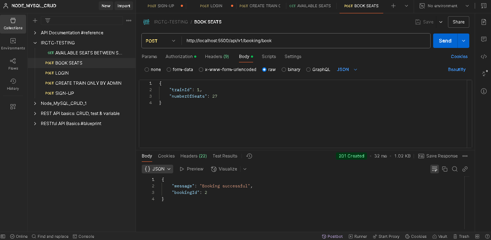

# Railway Management System API – Technical Implementation Details

This document explains, step by step, how I built the Railway Management System API. The API allows users to register, log in, check train availability, and book seats. Admin users can add new trains. I’ve implemented security measures using JWT for authentication and an API key for protecting admin endpoints. 

To run this project, first clone this repo using 

```rb
git glone https://github.com/adityaslg2001/IRCTC-API.git
```

Then navigate into the root directory of your project and in your terminal do: 

```rb
npm i
```

This will download all the dependencies from npm. 

To ensure smooth running of this project: ensure,

- Nodejs is installed.
- MySQL is running locally or on phpMyAdmin.
- To test APIs, I have used Postman app. (local)  [I HAVE INCLUDED ALL IMAGES FOR YOUR REFERENCE]

## 1. Register a User

**Objective:**  
Allow new users to register on the platform.

**How I Did It:**

- **Endpoint:** `POST /api/v1/auth/register`
- **Input Data:**  
  Users send a JSON payload with their `name`, `email`, and `password` (the role defaults to `"user"`).

  
  
- **Processing Details:**
  - **Password Hashing:**  
    I used **bcrypt** to hash the password before saving it in the MySQL `users` table.
  - **Database Insertion:**  
    The user data is then inserted into the `users` table.
  - **JWT Generation:**  
    A JWT token is generated (using a secret stored in the environment variable) that includes the user's `id`, `name`, and `role`.

- **Output:**  
  A JSON response that includes the user’s details and the JWT token for further authentication.

  

---

## 2. Login User

**Objective:**  
Allow users to log into their accounts.

**How I Did It:**

- **Endpoint:** `POST /api/v1/auth/login`
- **Input Data:**  
  Users provide their `email` and `password` in a JSON payload.
  
- **Processing Details:**
  - **Credential Verification:**  
    The system looks up the user by email in the `users` table.
  - **Password Comparison:**  
    The provided password is compared to the hashed password stored in the database using **bcrypt**.
  - **JWT Token Generation:**  
    If the credentials match, a JWT token is generated that contains the user’s `id`, `name`, and `role`.

- **Output:**  
  A JSON response with the user's details and the JWT token, which is required for protected endpoints.

  

---

## 3. Add a New Train (Admin Only)

**Objective:**  
Allow admin users to add new trains with specified details like source, destination, and seat capacity.

**How I Did It:**

- **Endpoint:** `POST /api/v1/admin/train`
- **Security:**  
  This endpoint is protected by an API key. The request must include an `x-api-key` header that matches the `ADMIN_API_KEY` in the environment variables.

  
  
- **Input Data:**  
  Admins send a JSON payload with:
  - `train_no`
  - `train_name`
  - `source`
  - `destination`
  - `total_seats`
  
- **Processing Details:**
  - **API Key Validation:**  
    The admin middleware checks the API key before proceeding.
  - **Database Insertion:**  
    A new train is inserted into the `train` table. The `available_seats` is set to the same value as `total_seats`.

    

- **Output:**  
  A JSON response confirming that the train was added, including the new train’s ID.

---

## 4. Get Seat Availability

**Objective:**  
Allow users to fetch a list of available trains along with seat availability between a given source and destination.

**How I Did It:**

- **Endpoint:** `GET /api/v1/trains/availability`
- **Input Data:**  
  Users provide `source` and `destination` as query parameters.

  
  
- **Processing Details:**
  - The endpoint queries the `train` table for trains that match the given source and destination.
  
- **Output:**  
  A JSON array of trains with details like `train_no`, `train_name`, and `available_seats`.

  

---

## 5. Book a Seat

**Objective:**  
Allow authenticated users to book seats on a selected train.

**How I Did It:**

- **Endpoint:** `POST /api/v1/booking/book`
- **Security:**  
  This endpoint requires JWT authentication. The user must include a valid JWT token in the `Authorization` header as `Bearer <JWT_token>`.
  
- **Input Data:**  
  The request body includes:
  - `trainId`
  - `numberOfSeats`
 
  
  
- **Processing Details:**
  - **User Identification:**  
    Extracted the user’s `id` from the JWT token.
  - **Handling Concurrent Bookings:**  
    I started a MySQL transaction and locked the train record using a `FOR UPDATE` query. This prevents simultaneous modifications.
  - **Seat Deduction:**  
    I checked if enough seats are available. If they are, I deduct the booked seats from `available_seats`.
  - **Booking Record Creation:**  
    A new booking is recorded in the `bookings` table.
    
  
  
- **Output:**  
  A JSON response confirming the booking and providing a booking ID.

---

## 6. Get Specific Booking Details

**Objective:**  
Allow users to view the details of a booking they have made.

**How I Did It:**

- **Endpoint:** `GET /api/v1/booking/:id`
- **Security:**  
  This endpoint also requires JWT authentication. The JWT token must be sent in the `Authorization` header.

  
  
- **Input Data:**  
  The booking ID is provided as a URL parameter.
  
- **Processing Details:**
  - I verified that the booking belongs to the authenticated user by matching the booking’s `userId` with the `id` in the JWT token.
  
- **Output:**  
  A JSON response with the booking details.

---

## Additionally,

- **Admin API Key:**  
  All admin endpoints are protected using an API key. Only requests with the correct `x-api-key` header can perform admin actions.
  
- **JWT Authentication:**  
  For endpoints that involve booking or retrieving booking details, JWT authentication is enforced. The JWT token (obtained during login) must be provided in the `Authorization` header.

---

.
